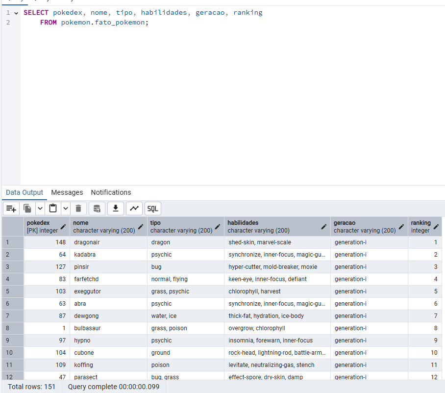

# Desafio Bravo Arquiteto de Solucoes 2025
 Desafio Arquiteto de Soluções 2025

## Passo a passo
**OBS: Antes de tudo, informar o arquivo `chave_teste_dev.json` com as credenciais de acesso na pasta `arquivos`**
***
Segue o passo a passo a passo para conseguir executar o desafio
- 1º. Rodar comando para subir o conteiner
```cmd
docker-compose up -d
```
***
- 2º. Acessar pgAdmin e configurar o acesso para o banco de dados
```html
http://localhost:8080/
```
No usuário, informar: bravo@bravo.com e senha: admin1234

Após clicar com o botão direito do mouse em Servers e com o botão esquerdo ir até a opção Register -> Server


Informar um nome para a conexão na aba ``General``


Na aba `Connection`, em `Host name/address` informar: postgres
Em `port` informar: 5432
Em `username` informar: bravo
Em `Password` informar: bravo123456
Após informar, clicar em `Save`


Após feito isso, deverá estar com este esquema no banco


***
- 3º. Configurar horário no código python
Localizar o arquivo `bravo.py`, e na linha 238, na chamada `scheduler.add_job` informar o horário para rodar e testar o script


***
- 4º. Após ajustar o horário, rodar o comando docker
```cmd
docker-compose up --build
```
o script python irá executar e ficará rodando até a próxima execução no próximo dia

***
- 5º. Verificar dados no Postgres pelo pgAdmin
Após a execução do script as tabelas estarão populados com os dados obtidos pelo GBQ e API


***
- 6º. Encerrar o Docker
Após verificar as tabelas e toda a execução do código, finalizar o Docker pelo comando
```cmd
Ctrl+C Ctrl+C
```

#### Comandos úteis
```cmd
docker exec -it postgres_container psql -U bravo -d Desafio_Bravo
docker-compose up -d
docker-compose up --build
```
